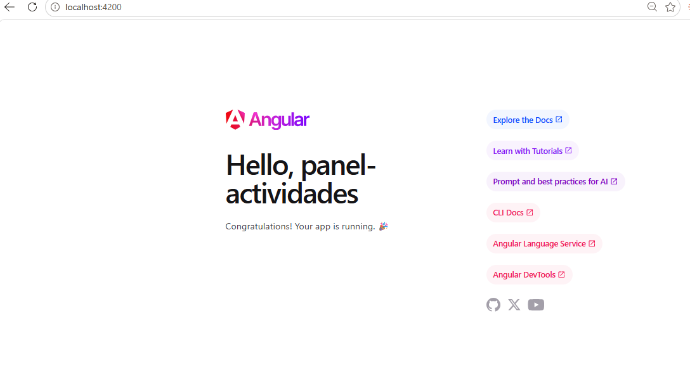
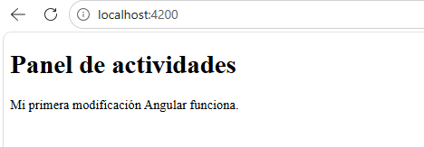
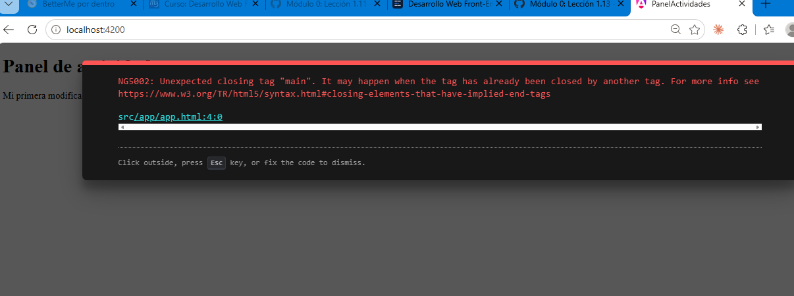

Esto es solo una prueba

## Modulo 0

## Práctica 1.8 - Navegación en terminal

- `pwd`: saber en qué directorio estoy.
- `ls`: ver los archivos y carpetas del directorio actual.
- `cd nombre`: entrar a una carpeta.
- `cd ..`: volver a la carpeta anterior.
- `mkdir nombre`: crear una carpeta.
- `npm start`: iniciar la aplicación para poder verla en el navegador.

## Práctica 1.9 - Instalar y verificar la línea base

Instalé Node.js 24.15.0 y luego verifiqué la versión de npm. Yo tenía una versión anterior de Angular CLI, así que la actualicé a la versión 22.1.4. Después volví a comprobar todas las versiones para asegurarme de que quedaron correctas.

También aprendí que Node.js trae npm incluido, que Angular CLI se instala usando npm y que el orden importa: primero se instala Node y después Angular CLI.

## Unidad 3 Del modulo 0 

## Leccion 1.11 - Crear el workspace

Ejecute este comando ' ng new panel-actividades --routing --style=css --skip-git --package-manager=npm --ssr=false --defaults '  me creo carpetas y paquetes necesarios en el proyecto . en la leccion los mas relevantes fueron:

panel-actividades/
├── package.json        ← qué necesita el proyecto y qué comandos tiene
├── package-lock.json   ← las versiones exactas que se instalaron
├── angular.json        ← cómo se compila y se sirve
└── src/
    └── app/
        ├── app.html    ← lo que se ve
        ├── app.css     ← cómo se ve
        └── app.ts      ← qué hace

### Lección 1.12 - Moverse por el proyecto

Aprendí a reconocer la raíz del workspace `panel-actividades`, porque ahí están `package.json` y `angular.json`.

También aprendí que debo fijarme en la ruta completa de los archivos y no solo en el nombre. Por ejemplo, `src/index.html` y `src/app/app.html` son archivos diferentes.

Los archivos principales de `src/app` son:

- `app.html`: estructura
- `app.css`: estilos
- `app.ts`: comportamiento

### Lección 1.13 - Ejecutar y modificar la aplicación

En esta lección inicié el proyecto con `npm start` y abrí la aplicación en la dirección que mostró la terminal.

Después modifiqué `src/app/app.html`, guardé los cambios y comprobé que Angular recompiló automáticamente y actualizó la pantalla sin tener que reiniciar el servidor.

### Lección 1.14 - Distinguir errores

En esta lección provoqué un error de compilación a propósito cambiando `<main>` por `<section>` y dejando `</main>`.

Angular mostró el error `Unexpected closing tag "main"` y me indicó el archivo y la línea donde estaba el problema.

Luego hice la corrección mínima, volví a poner `<main>` y comprobé que la aplicación compiló otra vez correctamente.

También aprendí qué hacer cuando aparece un error:

1. Identificar en qué capa apareció.
2. Leer el mensaje completo.
3. Revisar de qué archivo, carpeta o URL habla.
4. Pensar una sola causa posible.
5. Hacer un solo cambio.
6. Probar otra vez.
7. Comprobar que no rompí otra cosa.

